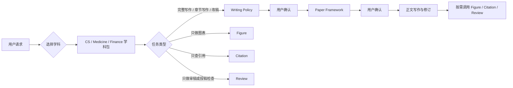

# Academic Writing Skill

`Academic Writing Skill` 是一个面向 AI 论文写作助手的多学科 skill 包，覆盖论文规划、初稿生成、章节改写、论文润色、图表表达、引用核查和投稿前审查等常见写作任务。它不是简单的“润色模板”，而是把论文构思、证据组织、章节写作、语言表达、图表设计和审稿风险拆成可执行的写作流程，让 AI 在生成和修改论文 artifact 时更像一个真正理解学术写作约束的助手。

English: [README_EN.md](README_EN.md)

目前已开发学科：

- `academic-cs-writing`：计算机、AI/ML、NLP、CV、HCI、系统、数据挖掘等。
- `academic-medicine-writing`：医学、临床、生物医学、公共卫生、诊断、预测模型、系统综述等。
- `academic-finance-writing`：金融、金融经济学、资产定价、公司金融、会计、银行、风险、金融计量等。

后续还会继续开发和补充其他学科方向。

## 写作理念与参考来源

该 skill 的写作方式提炼自被广泛认可的科研写作经验，具体包括：

- learning_research — 彭思达的科研经验：<https://github.com/pengsida/learning_research/tree/master>
- Ten Tips for Writing CS Papers — Sebastian Nowozin：<https://www.nowozin.net/sebastian/blog/ten-tips-for-writing-cs-papers-part-1.html>
- Writing a Good Introduction — Henning Schulzrinne，源自 Jim Kurose：<https://www.cs.columbia.edu/~hgs/etc/intro-style.html>
- The Science of Scientific Writing — Gopen and Swan：<https://inpp.ohio.edu/~meisel/PHYS6751/file/ScientificWriting_GGopenJSwanAmSci1990.pdf>

我们的目标是让 AI 学习这些真实可用的论文写作经验，使生成的论文更贴近真实研究者的写作习惯与表达风格。

## 核心流程



为了避免“一键生成”的初稿不符合真实论文写作习惯，Academic Writing Skill 在生成完整初稿之前设置了两个检查点：agent 必须分别在 `Writing Policy` 和 `Paper Framework` 阶段停下来，将原本可能被静默决定的内容展示给作者确认或修改，包括论文身份、证据边界、目标 venue、section 结构和图表计划等。

根路由还有一个硬规则：**无论用户输入是什么，都必须先判断学科，再判断任务类型**。即使用户只说“画一张表”“画一张图”“润色这段论文”，且没有提供工作目录，也要先从正文、标题、术语、venue、数据类型、变量、方法、引用或报告规范中判断属于 CS、医学还是金融；如果判断不出，必须立刻暂停，只问一个简短的学科选择问题。用户回答之前不能加载任何学科包，不能继续判断任务类型，也不能开始润色、画图、做表、查引用或审稿，不能直接默认某个学科包。

## 安装方式

### 方式一：默认下载整个仓库

```bash
git clone <repo-url> academic-writing-skill
```

如果要安装完整多学科包：

```bash
CODEX_HOME="${CODEX_HOME:-$HOME/.codex}"
mkdir -p "$CODEX_HOME/skills"
rsync -a --delete academic-writing-skill/ "$CODEX_HOME/skills/academic-writing-skill/"
```

整体安装后可以直接让路由 skill 选择学科：

```text
请用 academic-writing-skill 帮我根据这个实验目录写一篇 AI benchmark paper，先停在 Writing Policy。
Use academic-writing-skill to review this finance manuscript for submission readiness.
```

### 方式二：从本地仓库安装单个学科包

每个学科包都必须能独立运行；复制 `skills/<学科包>/` 一个目录即可安装，不依赖仓库根目录或其他学科包。

如果只想安装某个学科 skill，先 clone 整个仓库，再从本地复制对应目录：

```bash
CODEX_HOME="${CODEX_HOME:-$HOME/.codex}"
mkdir -p "$CODEX_HOME/skills"
rsync -a --delete academic-writing-skill/skills/academic-cs-writing/ "$CODEX_HOME/skills/academic-cs-writing/"
rsync -a --delete academic-writing-skill/skills/academic-medicine-writing/ "$CODEX_HOME/skills/academic-medicine-writing/"
rsync -a --delete academic-writing-skill/skills/academic-finance-writing/ "$CODEX_HOME/skills/academic-finance-writing/"
```

只选择需要的那一行执行即可。例如只安装 CS skill，就执行 `academic-cs-writing` 那一行。

## 三个学科包

| 学科包 | 适用任务 | 内部子 skill |
|---|---|---|
| `skills/academic-cs-writing/` | CS/AI 论文规划、写作、润色、修改、图表、引用、投稿前检查 | `academic-writing`、`academic-figure`、`academic-citation`、`academic-review` |
| `skills/academic-medicine-writing/` | 医学论文写作与润色、临床研究、公共卫生、系统综述、报告规范和投稿材料 | `academic-writing`、`academic-figure`、`academic-citation`、`academic-review` |
| `skills/academic-finance-writing/` | 金融论文写作与润色、金融计量、事件研究、资产定价、公司金融、working paper 和投稿包 | `academic-writing`、`academic-figure`、`academic-citation`、`academic-review` |

子 skill 的分工很简单：`academic-writing` 负责主流程，`academic-figure` 负责图表，`academic-citation` 负责引文和 BibTeX，`academic-review` 负责审稿视角和投稿前检查。

## 会议和期刊支持

| 学科 | 已内置或重点支持的 venue 类型 |
|---|---|
| CS | ICLR、NeurIPS、ICML、ACL、EMNLP、NAACL、CVPR、ICCV/ECCV、AAAI/IJCAI、KDD/WWW/SIGIR、CHI/UIST；JMLR、IEEE TPAMI、Nature、Nature Communications 和通用 journal profile。 |
| Medicine | 通用医学期刊、高影响临床期刊、公共卫生期刊、Nature-family biomedical journals；支持 CONSORT、STROBE、PRISMA、STARD、TRIPOD 等报告规范和 ICMJE-style statements。 |
| Finance | Journal of Finance、Journal of Financial Economics、Review of Financial Studies、JFQA、Review of Finance、Management Science、AEA journals、QJE、Econometrica、REStud；AFA/WFA/EFA/SFS/FMA、SSRN、NBER、CEPR 等会议和 working-paper 平台。 |

真实投稿前仍应以目标会议/期刊的最新 official instructions 为准。skill 会把未确认的格式、页数、匿名、数据代码和声明要求标记为 open decision 或 blocked。

## 示例请求

```text
请用 academic-writing-skill 根据 /path/to/project 写一篇 CS 论文，目标会议是 EMNLP。
请用 academic-medicine-writing 根据这个临床队列实验目录生成 JAMA 风格的初稿。
Use academic-finance-writing to revise my asset-pricing working paper and check citation coverage.
请用 academic-cs-writing 润色这篇论文的 Introduction，保持原意和实验结论不变。
请用 academic-cs-writing 帮我把这份实验结果画成图表。
请用 academic-medicine-writing 做投稿前自检，重点检查 STROBE、伦理声明、数据可用性和引用。
```

## 维护声明

本仓库仍在持续开发中，欢迎大家试用、反馈问题和提出改进建议。我们会第一时间处理影响安装、独立运行、学科路由、写作流程和输出质量的问题，并尽快更新 README、skill 指令和校验脚本。若在使用中发现某个 venue、学科场景或写作任务支持不足，也欢迎反馈具体场景和复现方式。
