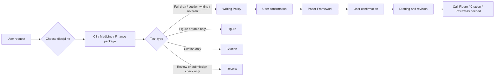

# Academic Writing Skill

Chinese: [README.md](README.md)

`Academic Writing Skill` is a multi-discipline skill bundle for AI academic-writing assistants. It covers paper planning, first-draft generation, section rewriting, manuscript polishing, figure/table work, citation checking, and pre-submission review. It is not just a polishing template: it breaks paper ideas, evidence organization, section writing, prose expression, display design, and reviewer risk into executable writing workflows, so AI-generated and AI-revised paper artifacts can better respect real academic-writing constraints.

Currently developed disciplines:

- `academic-cs-writing`: computer science, AI/ML, NLP, CV, HCI, systems, data mining, and related papers.
- `academic-medicine-writing`: medicine, clinical research, biomedical research, public health, diagnostics, prediction models, and systematic reviews.
- `academic-finance-writing`: finance, financial economics, asset pricing, corporate finance, accounting, banking, risk, and econometrics.

More disciplines will be developed and added over time.

## Writing Ideas And References

The writing approach is distilled from widely recognized research-writing experience:

- learning_research — Peng Sida's research experience: <https://github.com/pengsida/learning_research/tree/master>
- Ten Tips for Writing CS Papers — Sebastian Nowozin: <https://www.nowozin.net/sebastian/blog/ten-tips-for-writing-cs-papers-part-1.html>
- Writing a Good Introduction — Henning Schulzrinne, from Jim Kurose: <https://www.cs.columbia.edu/~hgs/etc/intro-style.html>
- The Science of Scientific Writing — Gopen and Swan: <https://inpp.ohio.edu/~meisel/PHYS6751/file/ScientificWriting_GGopenJSwanAmSci1990.pdf>

Our goal is to help AI learn these practical paper-writing experiences, so generated manuscripts better match the writing habits and expression style of real researchers.

## Core Workflow



To avoid one-click first drafts that do not match real paper-writing habits, Academic Writing Skill sets two checkpoints before generating a complete draft: the agent must stop at both the `Writing Policy` and `Paper Framework` stages, exposing decisions that might otherwise be made silently for author confirmation or revision, including paper identity, evidence boundaries, target venue, section structure, and figure/table plans.

The root router also has a hard rule: **for every user request, classify discipline before task type**. Even if the user only asks to "draw a table," "draw a figure," or "polish this paragraph" and provides no working directory, first infer whether the content belongs to CS, medicine, or finance from the prose, title, venue, terminology, data type, variables, methods, citations, or reporting standard. If the discipline is not clear, pause immediately and ask only one concise discipline-selection question. Until the user answers, do not load any discipline package, classify task type, polish prose, create figures or tables, check citations, or review the manuscript, and do not silently default to a package.

## Install

Download the full repository by default:

```bash
git clone https://github.com/AI45Lab/Academic-Writing-skill.git academic-writing-skill
```

To install the full multi-discipline bundle:

```bash
CODEX_HOME="${CODEX_HOME:-$HOME/.codex}"
mkdir -p "$CODEX_HOME/skills"
rsync -a --delete academic-writing-skill/ "$CODEX_HOME/skills/academic-writing-skill/"
```

Install only one discipline package from the local clone:

Each discipline package is self-contained. Copying one `skills/<package>/` directory is enough; it must not depend on the repository root or sibling disciplines.

If you only want to install one discipline skill, clone the full repository first, then copy the corresponding local directory:

```bash
CODEX_HOME="${CODEX_HOME:-$HOME/.codex}"
mkdir -p "$CODEX_HOME/skills"
rsync -a --delete academic-writing-skill/skills/academic-cs-writing/ "$CODEX_HOME/skills/academic-cs-writing/"
rsync -a --delete academic-writing-skill/skills/academic-medicine-writing/ "$CODEX_HOME/skills/academic-medicine-writing/"
rsync -a --delete academic-writing-skill/skills/academic-finance-writing/ "$CODEX_HOME/skills/academic-finance-writing/"
```

Run only the line for the package you need. For example, to install only the CS skill, run the `academic-cs-writing` line.

## Discipline Packages

| Package | Scope | Internal sub-skills |
|---|---|---|
| `skills/academic-cs-writing/` | CS/AI planning, writing, polishing, revision, figures, citations, and pre-submission checks | `academic-writing`, `academic-figure`, `academic-citation`, `academic-review` |
| `skills/academic-medicine-writing/` | Medical manuscript writing and polishing, clinical/public-health studies, reporting guidelines, and submission materials | `academic-writing`, `academic-figure`, `academic-citation`, `academic-review` |
| `skills/academic-finance-writing/` | Finance-paper writing and polishing, econometrics, event studies, asset pricing, working papers, and submission packages | `academic-writing`, `academic-figure`, `academic-citation`, `academic-review` |

## Venue Support

| Discipline | Built-in or emphasized venue families |
|---|---|
| CS | ICLR, NeurIPS, ICML, ACL, EMNLP, NAACL, CVPR, ICCV/ECCV, AAAI/IJCAI, KDD/WWW/SIGIR, CHI/UIST; JMLR, IEEE TPAMI, Nature, Nature Communications, and generic journal profiles. |
| Medicine | General medical journals, high-impact clinical journals, public-health journals, Nature-family biomedical journals; CONSORT, STROBE, PRISMA, STARD, TRIPOD, and ICMJE-style statements. |
| Finance | Journal of Finance, Journal of Financial Economics, Review of Financial Studies, JFQA, Review of Finance, Management Science, AEA journals, QJE, Econometrica, REStud; AFA/WFA/EFA/SFS/FMA, SSRN, NBER, and CEPR. |

The current official instructions of the target venue remain authoritative before real submission.

## Example Prompts

```text
Use academic-writing-skill to write a CS paper from /path/to/project for EMNLP.
Use academic-medicine-writing to generate a JAMA-style first draft from this clinical cohort workspace.
Use academic-finance-writing to revise my asset-pricing working paper and check citation coverage.
Use academic-cs-writing to polish this paper's Introduction while preserving the original meaning and experimental conclusions.
Use academic-cs-writing to turn these experimental results into paper figures.
Use academic-medicine-writing to run a pre-submission check, focusing on STROBE, ethics statements, data availability, and citations.
```

## Maintenance Statement

This repository is under active development. Feedback, bug reports, and improvement suggestions are welcome. We will address issues that affect installation, standalone package use, discipline routing, writing workflow, and output quality as quickly as possible, and update the README, skill instructions, and validators promptly. If a venue, discipline scenario, or writing task is not well covered, please report the concrete use case and reproduction path.
