# Academic Writing Skill

<p>
  <a href="README.md">简体中文版</a>
  &nbsp;|&nbsp;
  <a href="README_EN.md"><strong>English</strong></a>
</p>

`Academic Writing Skill` is a multi-discipline skill bundle for AI academic-writing assistants. It covers paper planning, first-draft generation, section rewriting, manuscript polishing, figure/table work, citation checking, and pre-submission review. It is not just a polishing template: it breaks paper ideas, evidence organization, section writing, prose expression, display design, and reviewer risk into executable writing workflows, so AI-generated and AI-revised paper artifacts can better respect real academic-writing constraints.

Currently developed disciplines:

- `academic-cs-writing`: computer science, AI/ML, NLP, CV, HCI, systems, data mining, and related papers.
- `academic-medicine-writing`: medicine, clinical research, biomedical research, public health, diagnostics, prediction models, and systematic reviews.
- `academic-finance-writing`: finance, financial economics, asset pricing, corporate finance, accounting, banking, risk, and econometrics.

More disciplines will be developed and added over time.

## Writing Ideas And References

The writing approach is distilled from widely recognized research-writing experience:

- learning_research — Peng Sida's research experience: <https://github.com/pengsida/learning_research/tree/master>
- Ten Tips for Writing CS Papers — Sebastian Nowozin: <https://www.nowozin.net/sebastian/blog/ten-tips-for-writing-cs-papers-part-1.html>
- Writing a Good Introduction — Henning Schulzrinne, from Jim Kurose: <https://www.cs.columbia.edu/~hgs/etc/intro-style.html>
- The Science of Scientific Writing — Gopen and Swan: <https://inpp.ohio.edu/~meisel/PHYS6751/file/ScientificWriting_GGopenJSwanAmSci1990.pdf>

Our goal is to help AI learn these practical paper-writing experiences, so generated manuscripts better match the writing habits and expression style of real researchers.

## Core Workflow

Academic Writing Skill first routes the request to the appropriate discipline package, then handles the requested writing task. A complete first draft usually follows `Writing Policy -> user confirmation -> Paper Framework -> user confirmation -> drafting and revision`. If the user only needs section rewriting, polishing, figures, citation checking, or pre-submission review, the corresponding task can be entered directly without running the full-draft workflow.

To avoid one-click first drafts that do not match real paper-writing habits, Academic Writing Skill sets two checkpoints before generating a complete draft: the agent must stop at both the `Writing Policy` and `Paper Framework` stages, exposing decisions that might otherwise be made silently for author confirmation or revision, including paper identity, evidence boundaries, target venue, section structure, and figure/table plans.

## Chart Design

We also strengthen paper figure and chart design across common chart scenarios in CS, medicine, finance, and related disciplines, including comparisons, trends, uncertainty displays, diagnostic evaluation, survival analysis, review evidence, omics, and health-economics displays, with attention to chart-type selection, layout, color, information density, and readability. The table below shows selected examples.

<table>
  <thead>
    <tr>
      <th align="left">Chart family</th>
      <th align="center">PDF example</th>
    </tr>
  </thead>
  <tbody>
    <tr>
      <td><strong>Bar and comparison</strong></td>
      <td align="center" width="72%">
        <a href="assets/readme/chart-gallery/pdfs/01_bar_comparison.pdf">
          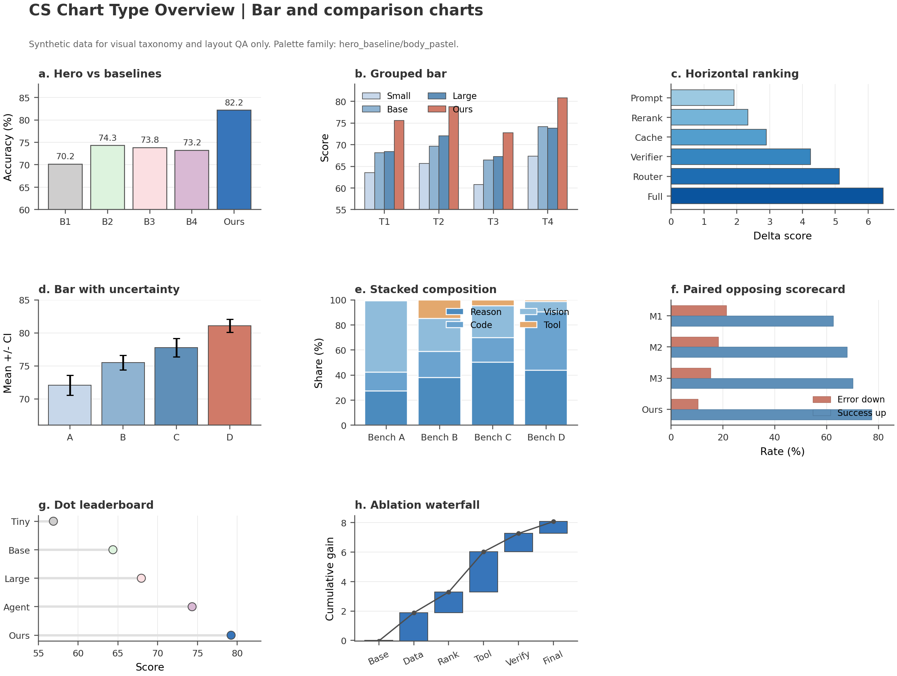
        </a>
      </td>
    </tr>
    <tr>
      <td><strong>Line / longitudinal</strong></td>
      <td align="center" width="72%">
        <a href="assets/readme/chart-gallery/pdfs/02_line_longitudinal.pdf">
          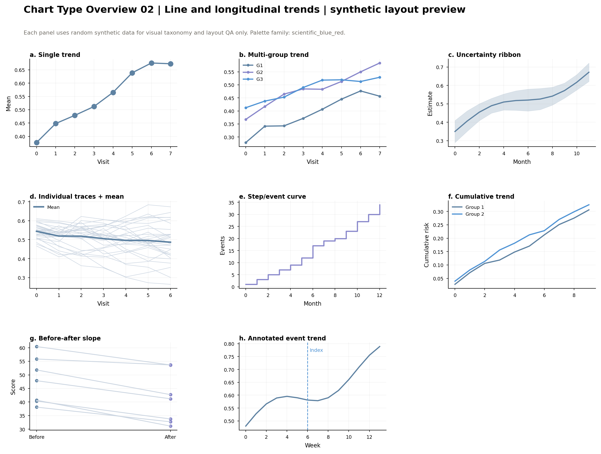
        </a>
      </td>
    </tr>
    <tr>
      <td><strong>Scatter / Pareto</strong></td>
      <td align="center" width="72%">
        <a href="assets/readme/chart-gallery/pdfs/03_scatter_pareto.pdf">
          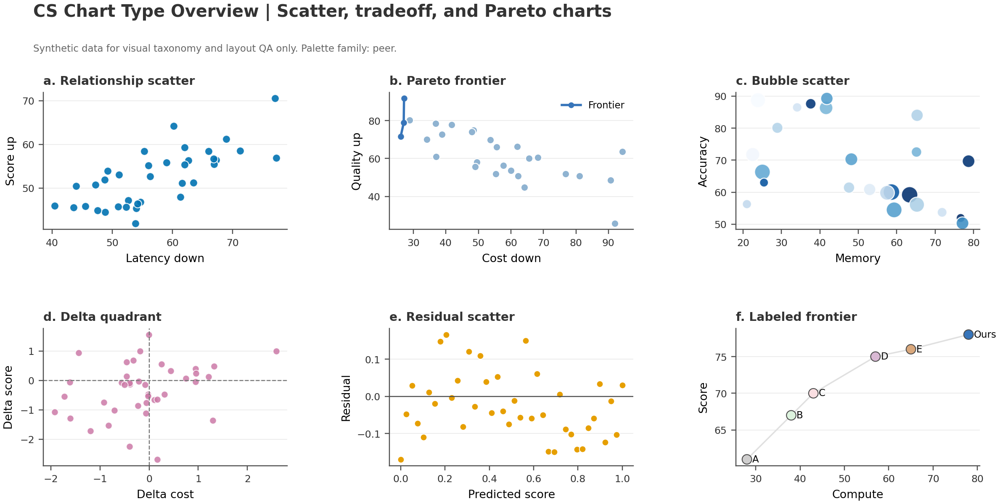
        </a>
      </td>
    </tr>
    <tr>
      <td><strong>Distribution / uncertainty</strong></td>
      <td align="center" width="72%">
        <a href="assets/readme/chart-gallery/pdfs/05_distribution_uncertainty.pdf">
          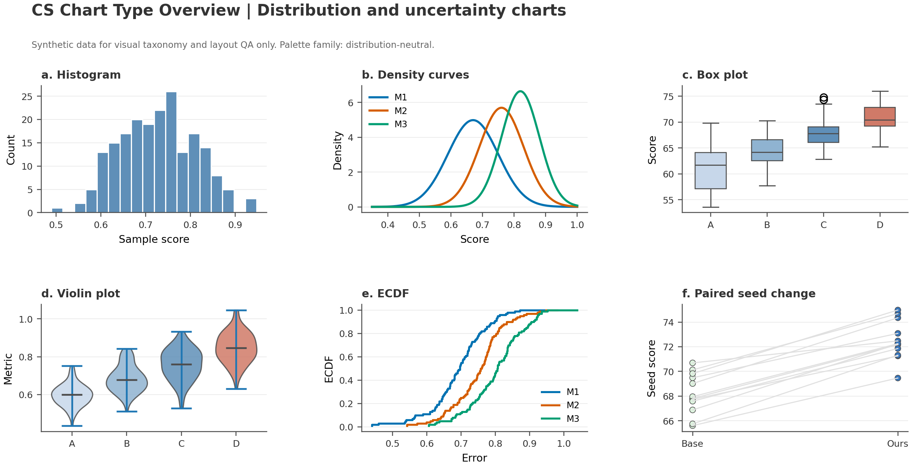
        </a>
      </td>
    </tr>
    <tr>
      <td><strong>Survival / time-to-event</strong></td>
      <td align="center" width="72%">
        <a href="assets/readme/chart-gallery/pdfs/06_survival_time_to_event.pdf">
          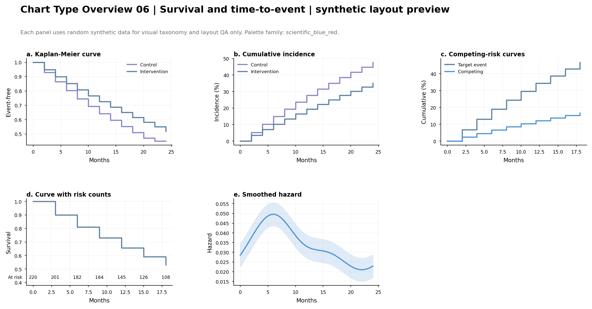
        </a>
      </td>
    </tr>
    <tr>
      <td><strong>Profile summaries</strong></td>
      <td align="center" width="72%">
        <a href="assets/readme/chart-gallery/pdfs/07_profile_summaries.pdf">
          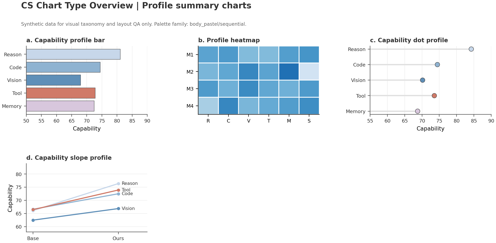
        </a>
      </td>
    </tr>
    <tr>
      <td><strong>Effect / review evidence</strong></td>
      <td align="center" width="72%">
        <a href="assets/readme/chart-gallery/pdfs/07_effect_review.pdf">
          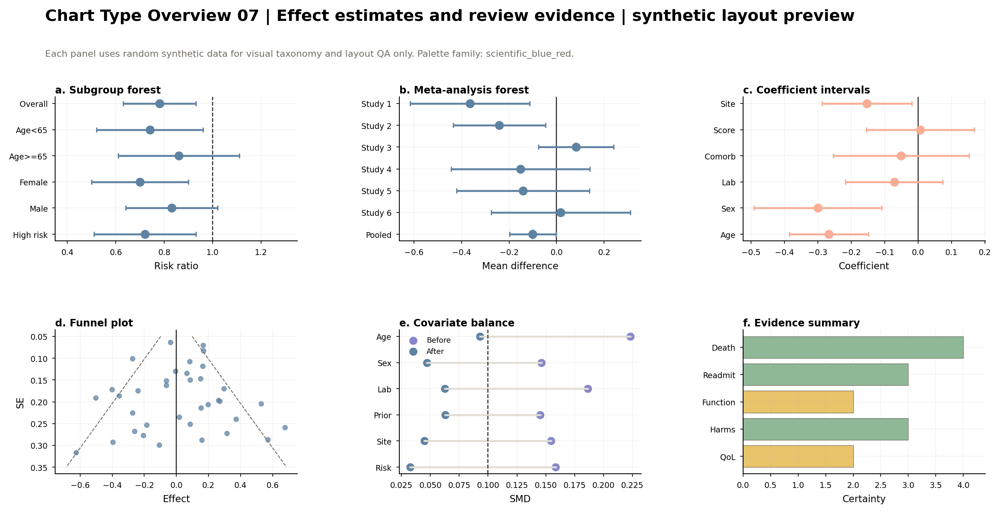
        </a>
      </td>
    </tr>
    <tr>
      <td><strong>Diagnostic / extended</strong></td>
      <td align="center" width="72%">
        <a href="assets/readme/chart-gallery/pdfs/09_diagnostic_extended.pdf">
          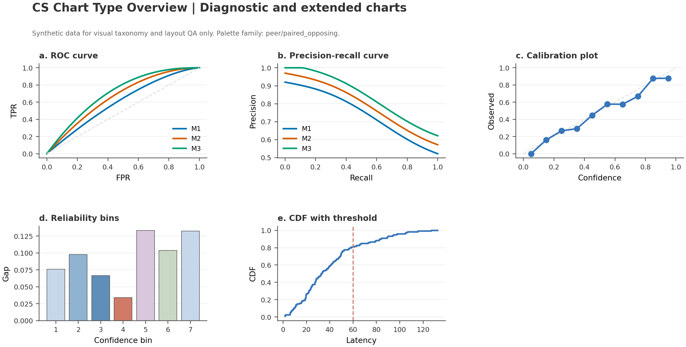
        </a>
      </td>
    </tr>
    <tr>
      <td><strong>Biomarker / omics</strong></td>
      <td align="center" width="72%">
        <a href="assets/readme/chart-gallery/pdfs/09_biomarker_omics.pdf">
          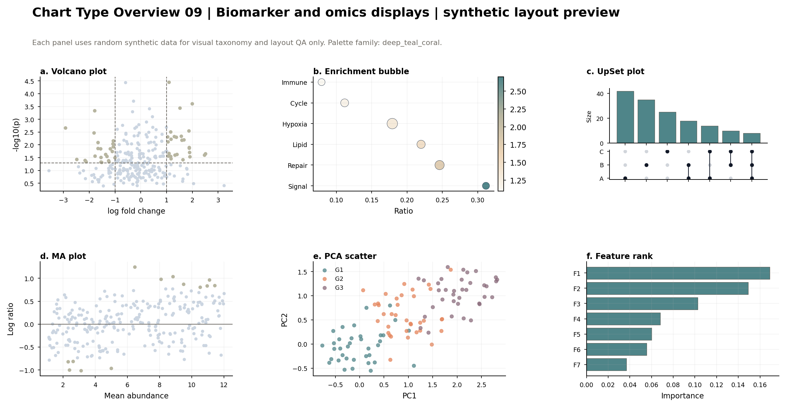
        </a>
      </td>
    </tr>
    <tr>
      <td><strong>Qualitative / composite</strong></td>
      <td align="center" width="72%">
        <a href="assets/readme/chart-gallery/pdfs/10_qualitative_composites.pdf">
          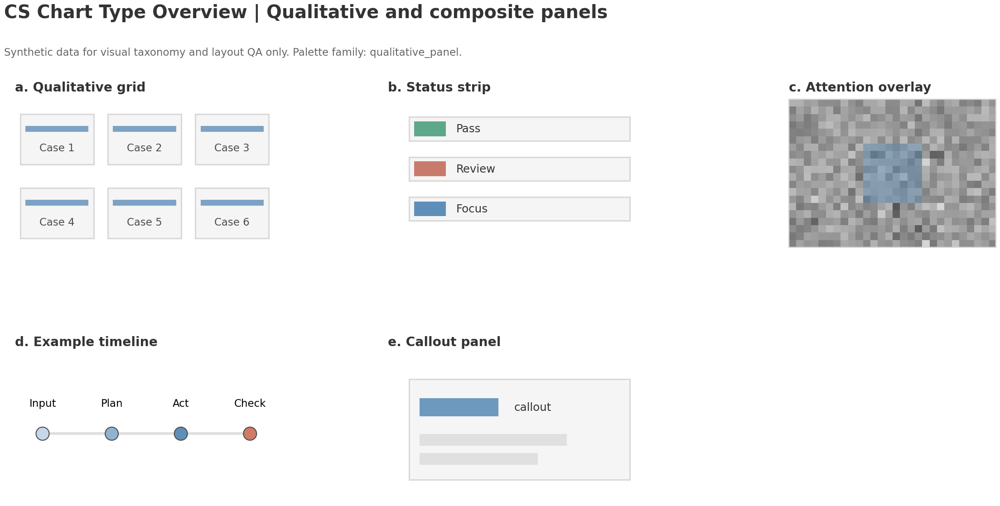
        </a>
      </td>
    </tr>
    <tr>
      <td><strong>Global health / economics</strong></td>
      <td align="center" width="72%">
        <a href="assets/readme/chart-gallery/pdfs/11_global_health_economics.pdf">
          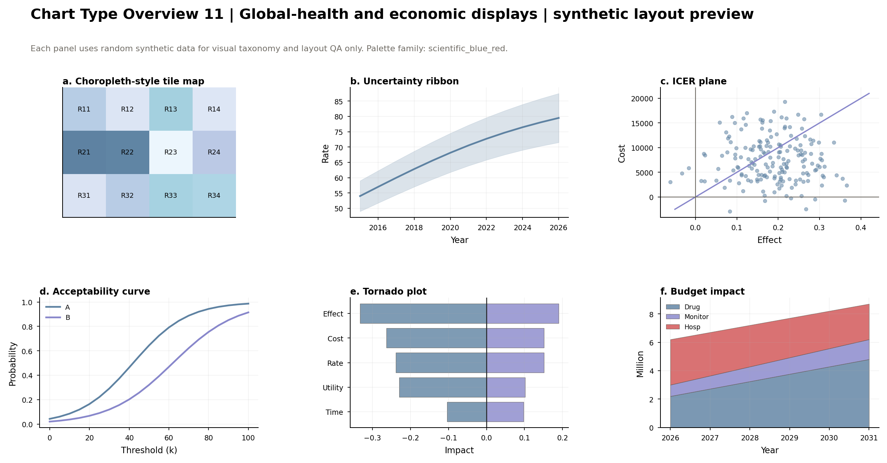
        </a>
      </td>
    </tr>
  </tbody>
</table>

## Install

> Quick install: you can copy the repository URL `https://github.com/AI45Lab/Academic-Writing-skill.git` directly to your AI agent and ask it to install the full bundle or one discipline package by following this README.

Clone the repository first:

```bash
git clone https://github.com/AI45Lab/Academic-Writing-skill.git
cd Academic-Writing-skill
```

### Codex

Full bundle, Mac / Linux:

```bash
CODEX_HOME="${CODEX_HOME:-$HOME/.codex}"
mkdir -p "$CODEX_HOME/skills/academic-writing-skill"
rsync -a --delete --exclude '.git/' ./ "$CODEX_HOME/skills/academic-writing-skill/"
```

Full bundle, Windows PowerShell:

```powershell
$CodexHome = if ($env:CODEX_HOME) { $env:CODEX_HOME } else { Join-Path $env:USERPROFILE ".codex" }
$Target = Join-Path $CodexHome "skills\academic-writing-skill"
Remove-Item $Target -Recurse -Force -ErrorAction SilentlyContinue
New-Item -ItemType Directory -Force -Path $Target | Out-Null
Copy-Item -Path ".\*" -Destination $Target -Recurse -Force
Remove-Item -Path (Join-Path $Target ".git") -Recurse -Force -ErrorAction SilentlyContinue
```

### Claude Code

Full bundle, Mac / Linux:

```bash
mkdir -p "$HOME/.claude/skills/academic-writing-skill"
rsync -a --delete --exclude '.git/' ./ "$HOME/.claude/skills/academic-writing-skill/"
```

Full bundle, Windows PowerShell:

```powershell
$Target = Join-Path $env:USERPROFILE ".claude\skills\academic-writing-skill"
Remove-Item $Target -Recurse -Force -ErrorAction SilentlyContinue
New-Item -ItemType Directory -Force -Path $Target | Out-Null
Copy-Item -Path ".\*" -Destination $Target -Recurse -Force
Remove-Item -Path (Join-Path $Target ".git") -Recurse -Force -ErrorAction SilentlyContinue
```

### Install One Discipline Package

Each discipline package is self-contained. Copying one `skills/<package>/` directory is enough; it must not depend on the repository root or sibling disciplines.

The example below installs the CS package. Medicine or finance users can replace `academic-cs-writing` with `academic-medicine-writing` or `academic-finance-writing`.

Mac / Linux:

```bash
SKILL_HOME="${CODEX_HOME:-$HOME/.codex}/skills"
# For Claude Code, use: SKILL_HOME="$HOME/.claude/skills"
mkdir -p "$SKILL_HOME/academic-cs-writing"
rsync -a --delete "skills/academic-cs-writing/" "$SKILL_HOME/academic-cs-writing/"
```

## Discipline Packages

| Package | Scope | Internal sub-skills |
|---|---|---|
| `skills/academic-cs-writing/` | CS/AI planning, writing, polishing, revision, figures, citations, and pre-submission checks | `academic-writing`, `academic-figure`, `academic-citation`, `academic-review` |
| `skills/academic-medicine-writing/` | Medical manuscript writing and polishing, clinical/public-health studies, reporting guidelines, and submission materials | `academic-writing`, `academic-figure`, `academic-citation`, `academic-review` |
| `skills/academic-finance-writing/` | Finance-paper writing and polishing, econometrics, event studies, asset pricing, working papers, and submission packages | `academic-writing`, `academic-figure`, `academic-citation`, `academic-review` |

## Venue Support

| Discipline | Built-in or emphasized venue families |
|---|---|
| CS | ICLR, NeurIPS, ICML, ACL, EMNLP, NAACL, CVPR, ICCV/ECCV, AAAI/IJCAI, KDD/WWW/SIGIR, CHI/UIST; JMLR, IEEE TPAMI, Nature, Nature Communications, and generic journal profiles. |
| Medicine | General medical journals, high-impact clinical journals, public-health journals, Nature-family biomedical journals; CONSORT, STROBE, PRISMA, STARD, TRIPOD, and ICMJE-style statements. |
| Finance | Journal of Finance, Journal of Financial Economics, Review of Financial Studies, JFQA, Review of Finance, Management Science, AEA journals, QJE, Econometrica, REStud; AFA/WFA/EFA/SFS/FMA, SSRN, NBER, and CEPR. |

The current official instructions of the target venue remain authoritative before real submission.

## Example Prompts

```text
Use academic-writing-skill to write a CS paper from /path/to/project for EMNLP.
Use academic-medicine-writing to generate a JAMA-style first draft from this clinical cohort workspace.
Use academic-finance-writing to revise my asset-pricing working paper and check citation coverage.
Use academic-cs-writing to polish this paper's Introduction while preserving the original meaning and experimental conclusions.
Use academic-cs-writing to turn these experimental results into paper figures.
Use academic-medicine-writing to run a pre-submission check, focusing on STROBE, ethics statements, data availability, and citations.
```

## Maintenance Statement

This repository is under active development. Feedback, bug reports, and improvement suggestions are welcome. We will address issues that affect installation, standalone package use, discipline routing, writing workflow, and output quality as quickly as possible, and update the README, skill instructions, and validators promptly. If a venue, discipline scenario, or writing task is not well covered, please report the concrete use case and reproduction path.
